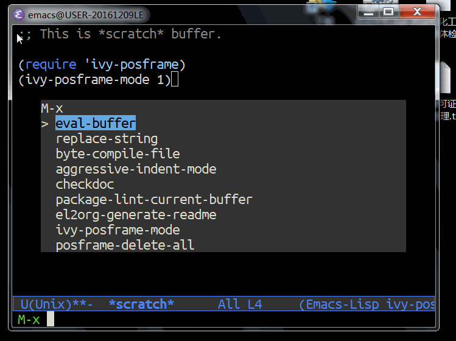

Note: this file is auto converted from ivy-posframe.el by [el2org](https://github.com/tumashu/el2org), please do not edit it by hand!!!

# &#30446;&#24405;

1.  [ivy-posframe README](#orga0194dc)
    1.  [What is ivy-posframe](#org9479e4f)
    2.  [Display functions](#org77c90ff)
    3.  [How to enable ivy-posframe](#orgbdb78e5)
    4.  [Tips](#orgd370bc2)
        1.  [How to show fringe to ivy-posframe](#orgdefc2c7)
        2.  [How to custom your ivy-posframe style](#org34f3a1d)

# ivy-posframe README

## What is ivy-posframe

ivy-posframe is a ivy extension, which let ivy use posframe
to show its candidate menu.

NOTE: ivy-posframe requires Emacs 26 and do not support
mouse click.

## Display functions

1.  ivy-posframe-display
2.  ivy-posframe-display-at-frame-center
3.  ivy-posframe-display-at-window-center
    
4.  ivy-posframe-display-at-frame-bottom-left
5.  ivy-posframe-display-at-window-bottom-left
    
6.  ivy-posframe-display-at-frame-bottom-window-center
7.  ivy-posframe-display-at-point
    

## How to enable ivy-posframe

1.  Global mode
    
        (require 'ivy-posframe)
        (setq ivy-display-function #'ivy-posframe-display)
        ;; (setq ivy-display-function #'ivy-posframe-display-at-frame-center)
        ;; (setq ivy-display-function #'ivy-posframe-display-at-window-center)
        ;; (setq ivy-display-function #'ivy-posframe-display-at-frame-bottom-left)
        ;; (setq ivy-display-function #'ivy-posframe-display-at-window-bottom-left)
        ;; (setq ivy-display-function #'ivy-posframe-display-at-point)
        (ivy-posframe-enable)
2.  Per-command mode.
    
        (require 'ivy-posframe)
        ;; Different command can use different display function.
        (push '(counsel-M-x . ivy-posframe-display-at-window-bottom-left) ivy-display-functions-alist)
        (push '(complete-symbol . ivy-posframe-display-at-point) ivy-display-functions-alist)
        (ivy-posframe-enable)
3.  Fallback mode
    
        (require 'ivy-posframe)
        (push '(t . ivy-posframe-display) ivy-display-functions-alist)
        (ivy-posframe-enable)

## Tips

### How to show fringe to ivy-posframe

    (setq ivy-posframe-parameters
          '((left-fringe . 10)
            (right-fringe . 10)))

By the way, User can set **any** parameters of ivy-posframe with
the help of \`ivy-posframe-parameters'.

### How to custom your ivy-posframe style

The simplest way is:

    (defun ivy-posframe-display-at-XXX (str)
      (ivy-posframe--display str #'your-own-poshandler-function))
    (ivy-posframe-enable) ; This line is needed.

